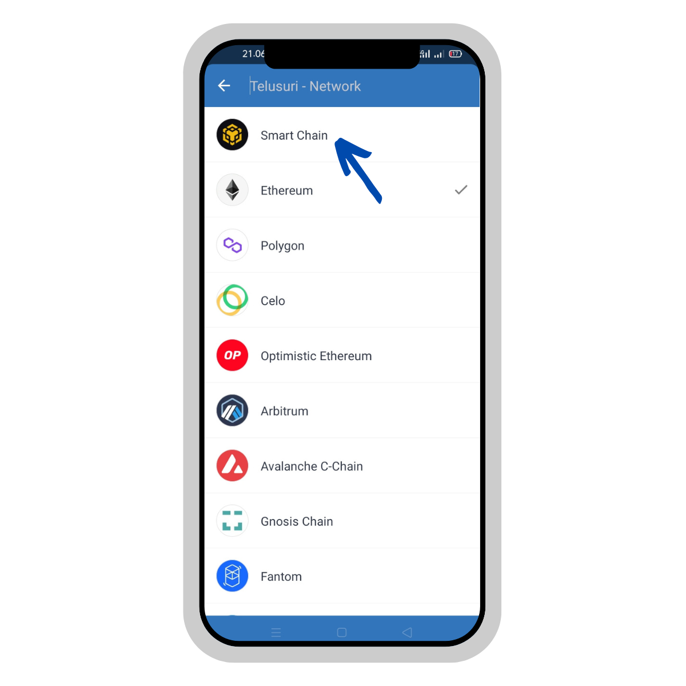

# 🖱 Apply to earn

.png>)

## Apply to earn concept

When new member/user click connect wallet button, he must pay gass fee and receive some token as reward and become a contributor of motoran project.



This is the details how to do apply to earn in desktop browser.

1. Visit main website with[ click here ](https://motoran.net/)using chrome, edge, brave or firefox browser. install the .png>)Metamask browser extension if .png>)Metamask is not already installed. follow the steps how to install .png>)Metamask [here](https://metamask.zendesk.com/hc/en-us/articles/360015489531-Getting-started-with-MetaMask).
2. Click the <mark style="color:orange;background-color:orange;">**`CONNECT WALLET`**</mark> button and sign with the wallet metamask. make sure you are connected to the binance smartchain  mainnet network. If you haven't added the binance smartchain mainnet network configuration, you can see how to configure it [here](https://coinmarketcap.com/alexandria/article/connect-metamask-to-binance-smart-chain-bsc).

3\. After click the <mark style="color:orange;">**`CONNECT BUTTON`**</mark> button then metamask will ask for confirmation and you have to pay some gas fees. after that all the process complete, you will receive MOTO as reward contributor. To become a contributor yu have to pay fee 0.004 .png>)BNB and and can proceed to the refer to earn program stage.

4\. Done.




This is the details how to do apply to earn in mobile using Trustwallet.

1. Open Trustwallet Application, if you don't have it, please install it from playstore/appstore.&#x20;

**Android:** [**https://play.google.com/store/apps/details?id=com.wallet.crypto.trustapp\&hl=in\&gl=US**](https://play.google.com/store/apps/details?id=com.wallet.crypto.trustapp\&hl=in\&gl=US)****

**IOS:** [**https://apps.apple.com/us/app/trust-crypto-bitcoin-wallet/id1288339409**](https://apps.apple.com/us/app/trust-crypto-bitcoin-wallet/id1288339409)****

2\. Open Dapps and enter motoran.net

3\. Change network to Smart Chain

4\. Connect Wallect

5\. Pay Gass Fee

6\. Done



