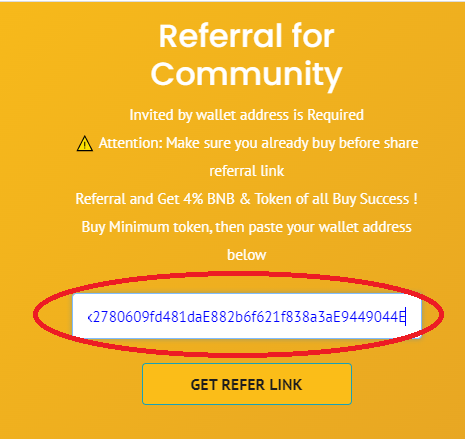

# 🧑🤝🧑 Referr to earn

.png>)

## Referr to earn concept

Referr to earn is when contributor paste link and people become a new member or user or buy token from referral link, contributor will receive 4% BNB and 2% token as reward for each transaction success.



This is the details how to do referr to earn in desktop browser.

1. Visit main website with[ click here ](https://motoran.net/)using chrome, edge, brave or firefox browser. install the .png>)Metamask browser extension if .png>)Metamask is not already installed. follow the steps how to install .png>)Metamask [here](https://metamask.zendesk.com/hc/en-us/articles/360015489531-Getting-started-with-MetaMask).
2. Copy wallet address on metamask.

3\. Paste wallet address on referral form then click <mark style="color:orange;">**`GET REFER LINK`**</mark> button.

4\. Copy your referral link and share it to your family& friend contact or social media. You will get a reward 4% .png>)BNB and 2% MOTO for all successful transactions.

.png>)

5\. Done.






