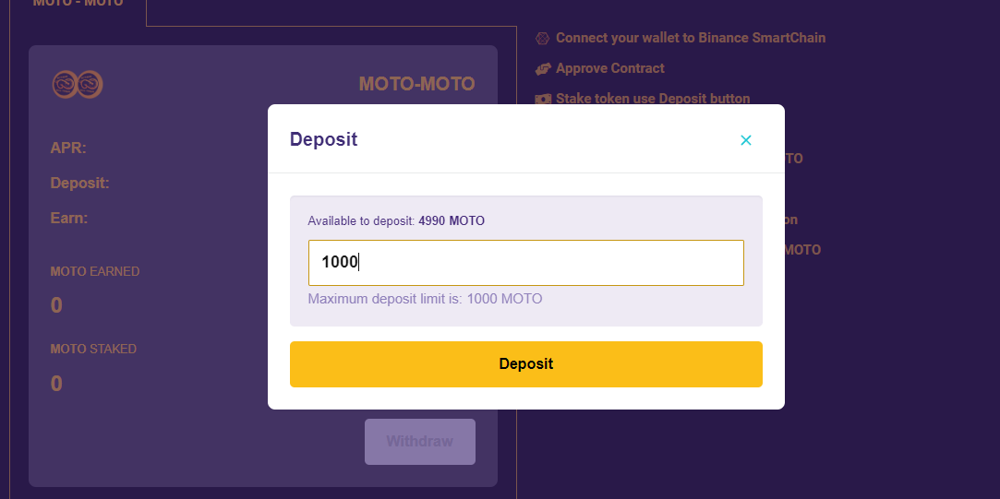

# 💰 Stake to earn

## Stake to earn concept

Hodler want to stake their motoran token will receive 45% APY from staking pool.

Penalty fee for early unstake is 1% send back to staking pool.



This is the details how to do staking in desktop browser.

1. Visit web staking with the link [Staking ](https://staking.motoran.net)using chrome, edge, brave or firefox browser. install the .png>)Metamask browser extension if .png>)Metamask is not already installed. follow the steps how to install .png>)Metamask [here](https://metamask.zendesk.com/hc/en-us/articles/360015489531-Getting-started-with-MetaMask).
2. Click the <mark style="color:orange;background-color:orange;">**`UNLOCK WALLET`**</mark> button and sign with the wallet metamask. make sure you are connected to the binance smartchain  mainnet network. If you haven't added the binance smartchain mainnet network configuration, you can see how to configure it [here](https://coinmarketcap.com/alexandria/article/connect-metamask-to-binance-smart-chain-bsc).

3\. Click the <mark style="color:orange;">**`APPROVE CONTRACT`**</mark> button and pay a certain amount of gas fee with a metamask wallet. gas fee using .png>)BNB. If you don't have a .png>)BNB yet, please buy a .png>)BNB at your favorite DEX or CEX then transfer the .png>)BNB to your metamask wallet.

4\. Click the <mark style="color:orange;">**`DEPOSIT`**</mark> button to stake MOTO.

5\. Maximum and minimum Deposit/Stake limit is **1000** MOTO.&#x20;

APR (Annual Percentage Rate) is 15%.

6\. After submitting the amount then click the <mark style="color:orange;">**`DEPOSIT`**</mark> button and metamask will ask for confirmation and you have to pay some gas fees. after that all the process of deposit / stake MOTO is complete.

7\. Done








