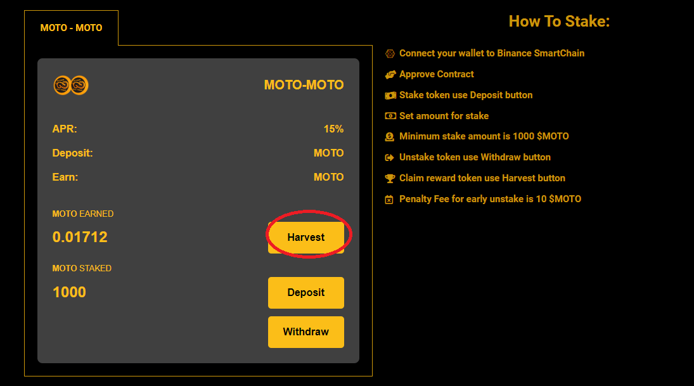
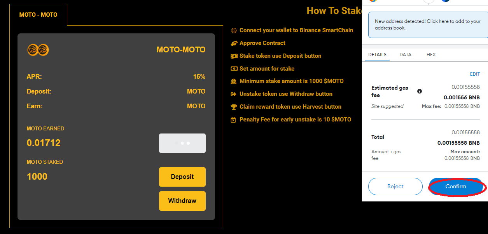

# Claim / Harvest



1. Click the <mark style="color:orange;">**`HARVEST`**</mark> button to claim MOTO as reward staking.

2\. After click the <mark style="color:orange;">**`HARVEST`**</mark> button then metamask will ask for confirmation and you have to pay some gas fees. after that all the process of Claim Reward/Harvest MOTO is complete.

3\. Done.






