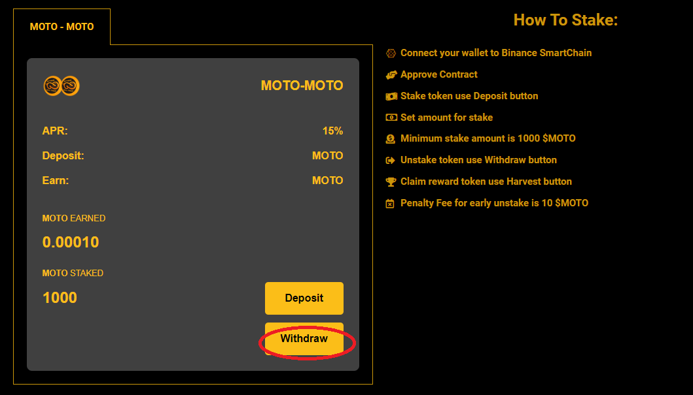
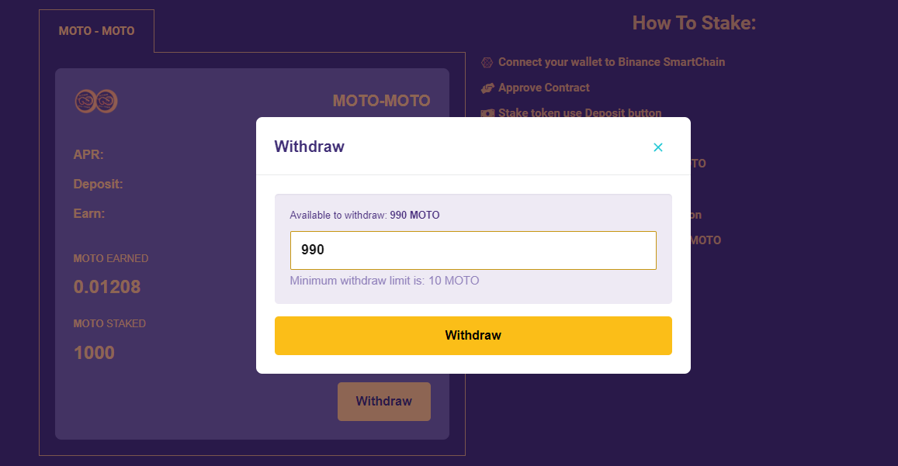
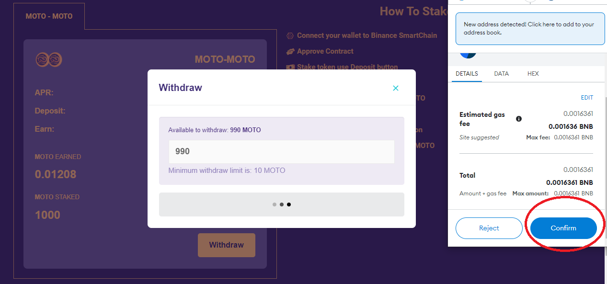

# Withdraw / Unstake



1. Click the <mark style="color:orange;">**`WITHDRAW`**</mark> button to unstake MOTO.

2\. Penalty Fee for early Withdraw/Untake is **10** MOTO.&#x20;

3\. After click the <mark style="color:orange;">**`WITHDRAW`**</mark> button then metamask will ask for confirmation and you have to pay some gas fees. after that all the process of Withdraw/Unstake MOTO is complete.

4\. Done






